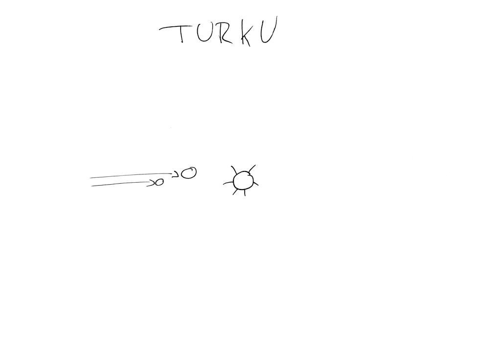
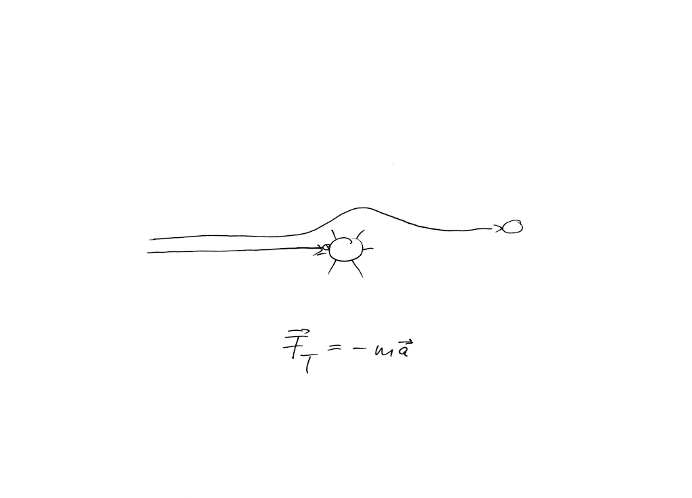
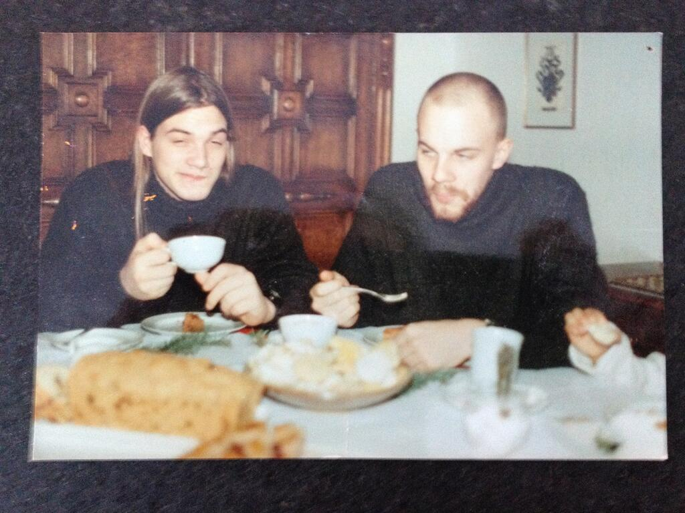
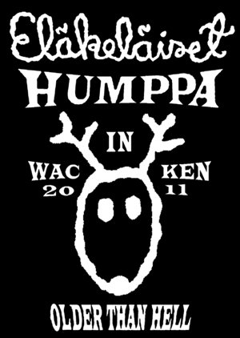
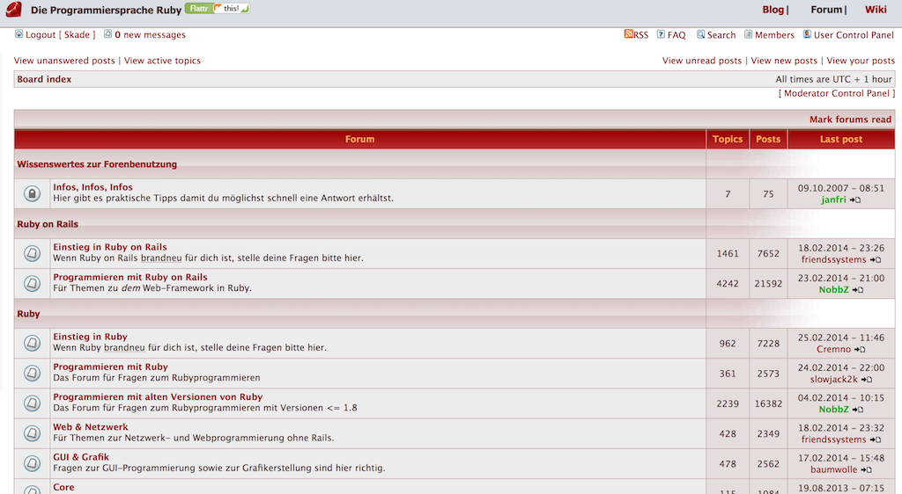
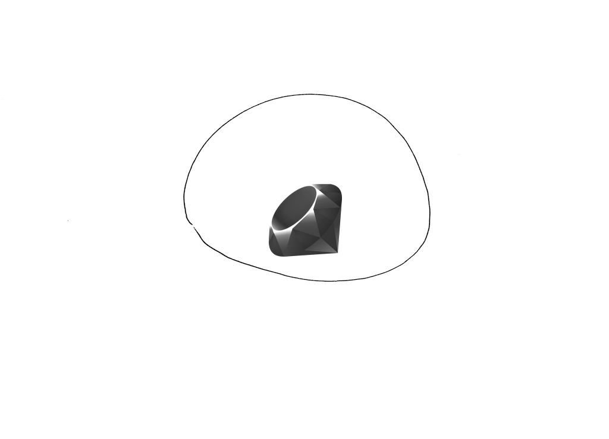
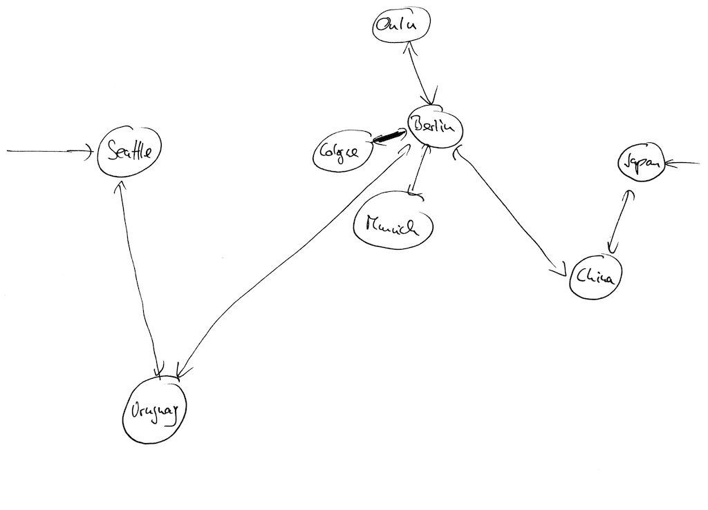
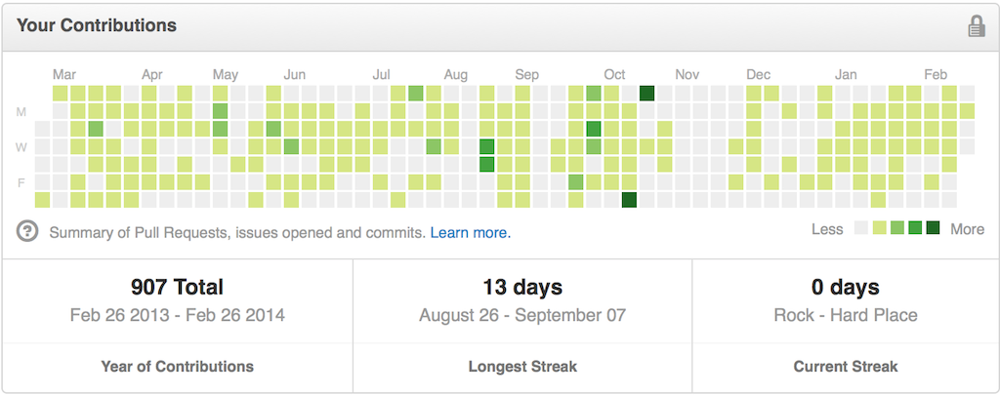

---

layout: ribbon

style: |

    #Cover h2 {
        margin:30px 0 0;
        color:#FFF;
        text-align:center;
        font-size:70px;
        }
    #Cover p {
        margin:10px 0 0;
        text-align:center;
        color:#FFF;
        font-style:italic;
        font-size:20px;
        }
        #Cover p a {
            color:#FFF;
            }
    #Picture h2 {
        color:#FFF;
        }
    #SeeMore h2 {
        font-size:100px
        }
    #SeeMore img {
        width:0.72em;
        height:0.72em;
        }
    .noHead  h2 {
        display: inline-block;
        visibility: hidden;
    }
    #dont-join-shitstorms h2 {
        color: red;
    }
    #think-before-you-tweet h2 {
        color: red;
    }
---

# Full Metal Rüby
{:.cover .Picture .FullMetal .noHead}

## 1988
{:.cover .Picture .Turku}

## 1988
{:.cover .Picture .Inertia .noHead}

## Fast forward: 1998

## **INTERNET**

## **BORING**

## 1999: Let's go metal
{:.cover .Picture .Metal .noHead}

## Let's go metal

* Got involved in a music community
* Metal to Rock
* Showed some sense for cooperation

## **2000: Mod bit**

## Let's go metal

* Got involved in a music community
* Metal to rock
* Showed some sense for cooperation
* Moderated porn pictures in profiles before I was legal to view them

## Fun fact

## **Conflicts**

## **Metal vs. Techno**

## **Black vs. True Metal**

## **Everyone vs. Nu Metal** 

## 2003: Ruby

* Started learning Ruby
* Joined a german bulleting board
* Showed some sense for cooperation
* Got a Mod-Bit

## Rubyforen
{:.cover .Picture .RubyForen .noHead}

## Today!

* Chair of the Ruby Berlin e.V.
* Chair of eurucamp and JRubyConf.eu
* Host of 2 users groups
* Still got that Mod-Bit...
* Never migrated the board to Ruby

## **Conflicts**

## **Everyone vs. PHP** 

## **Ruby vs. Java** 

## **OO vs. functional**

## **We're not different**

## **Full Metal Rüby**

## The Ruby community
{:.cover .Picture .RubyCommunity}

## There is no Ruby community
{:.cover .Picture .RubyCommunities}

## The Ruby community

* very opinion-driven and personal
* clashes are often
* values curiosity
* definitely imperfect
* MINASWAN

## **Technology**

## Online communities

* "close" is not necessarily physical distance
* discussions and movements can be more ongoing
* physical meetings are still very important and act as roots

## Open-source communities

* work-centered
* sometimes makes community-effort take the back seat
* commercial interest gives both momentum and friction

## Work-Centered
{:.cover .Picture .WorkCentered .noHead}

## Organizers/Moderators

* Forum/chat moderators
* Mailing list moderators
* Event organizers (meetups, conferences)
* Bugtracker work/Release planning

...Anyone who wants to mold and change the community.

## **Communicators**

## Important traits

* Good at discourse
  - discussions about music are good training
* Seriousness
* Empathy
* Ethics

...Being able to get hold of a good Barista is completely optional.

## Backchannels

Backchannels are the most important tool.

* to deal with personal things
* criticism without accusations
* to organize concerted action and behaviours

...Thats why you rarely see organization happening in the open.

## Time

Impactful action takes time. Expect days after
any event for people to get everything together.

Example: [Ruby Berlin Community Statement](http://rubyberlin.org/2013-10-statement-community.html) was 4 days of work.

## Twitter

Good for:

* Outreach
* Announcements
* The odd question

## Twitter

Bad for:

* discourse
* almost anything else of interest for Organizers
* ...being used as an engine for change

## **Don't join shitstorms**

## **Think before you tweet**

## Global Change (without Twitter)

1. have an agenda
2. have a looooong breath
3. convince others

## Global Change

1. start locally
2. introduce and validate your ideas there
3. control your message
4. spread to other subcommunities

## **Outreach**

## No-gos

* Don't pressure people into opinions or statements
* Don't attack unconvincable people
  - You can shun them, if you want to

## **Base Democracy**

## **Wait, Politics???**

## **Everything's political**

## **My Agenda**

## **1. Opposition**

## Problematic Characters

* Trolls, Professional Cynics, Devils Advocates
* Help Vampires
* People incapable of respecting personal space
* Everyone scaring off beginners

## Problematic Characters

Everyone should be welcome, but shown the door for misbehaving constantly.

## Do we need to be bad?

* An technical wonderchild should not be allowed to insult others
* New committers should never be chided for incompetence
* Abusive natures should be asked to leave communication to others

Complain politely everywhere you see such behaviour.

## Wait, thought police?

There are thin lines between:

* A pointed comment and dismissal of other peoples hard work
* A joke and an insult

Be careful, about the recipient!

## **State your dislike!**

## Have expectations!

Expect organizers to:

* communicate clearly
* bring communities forward
* stay up to speed with current movements
* hold your moral values

## **Polite and thoughtful**

## **Backchannel!**

## Sad truth

I've seen all of this happening:

* anonymous and open attacks
* threats
* exposures
* discriminations because of disabilities
* mobbing with impersonations

Programming communities are no different.

## We need to moderate the 1%

[Ryan Davis - Why we need to moderate the 1%](http://www.confreaks.com/videos/1085-cascadiaruby2012-occupy-ruby-why-we-need-to-moderate-the-1)

## **2. Diversity**

## Diversity

> Is that really a topic? - me, 5 years ago

> Yes, and its much more fun like that. - me, today

## Diversity

Diversity is much more than bringing woman (back) into the industry.

...Diversity is about allowing anyone to participate who shares our basic interests and morals.

...Diversity is a mindset, not a list of boxes to tick.

## **Technology**

## Diversity

Hard topic to wrap your head around.

## **Who is not here?**

## Individuals

Everyone has very particular and personal
reasons for not participating. Not
all can be cared for, but many.

## **Don't dismiss**

## Don't dismiss

Good organizers can support others even if they
cannot relate to their problems.

## **Empathy & Seriousness**

## Codification

Wouldn't it be nice if we could write that down for everyone to see?

## **Code of Conduct**

## A final quote

> I’m always uncomfortable at a lot of conferences because I don’t party, and I’m always left to feel like that’s bad, especially as a speaker.

> And I personally feel bad b/c I feel like I’m being anti-social (esp if I’m a speaker), but I don’t like being around stupidly drunk people.

## **Spoilsport?**

## **No**

## **You're Welcome!**
