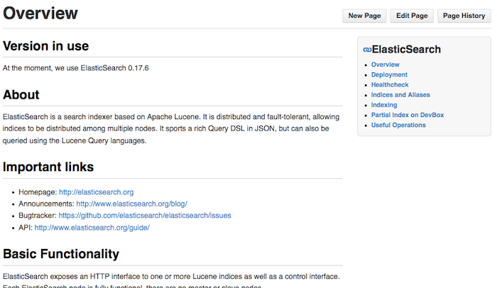
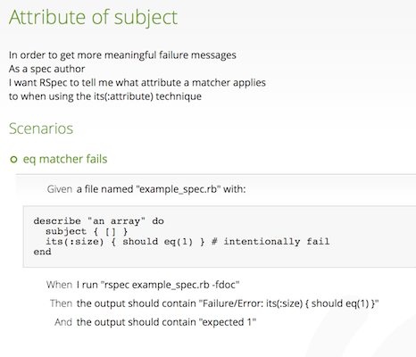
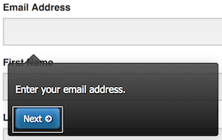

---

layout: ribbon

style: |

    #Cover h2 {
        margin:30px 0 0;
        color:#FFF;
        text-align:center;
        font-size:70px;
        }
    #Cover p {
        margin:10px 0 0;
        text-align:center;
        color:#FFF;
        font-style:italic;
        font-size:20px;
        }
        #Cover p a {
            color:#FFF;
            }

    .Picture .Warning h2 {
        color:#000000;
        }
    .Picture.AsAdvertised h2 {
        color:#FFFFFF;
        }
    .Picture.ThankYou h2 {
        color:#FFFFFF;
        }
    .Picture.ThirdParties h2 {
        color:#000000;
        }
    .Picture.Tools h2 {
        color:#000000;
        }
    #SeeMore h2 {
        font-size:100px
        }
    #SeeMore img {
        width:0.72em;
        height:0.72em;
        }
    .slide pre code {
      font-size: 20px;
      line-height: 25px;
    }
---

# Unicorns {#Cover}

<!-- photo by John Carey, fiftyfootshadows.net -->

## About me

* Florian Gilcher
* Twitter: [@argorak](http://github.com/argorak)
* Github: [skade](http://github.com/skade)
* Company: [http://asquera.de](http://asquera.de)

## Community organizer

* Conference chair of [eurucamp](http://eurucamp.org) and [JRubyConf.eu](http://jrubyconf.eu)
* Organizer of the [elasticsearch UG Berlin](www.meetup.com/ElasticSearch-UG-Berlin/)
* Co-Administrator of a german [Ruby community](http://rubyforen.de)
* [Padrino](http://padrinorb.com) core member on issue triage

## Warning
{:.cover .Picture .Warning}

## Warning

* I love banging my head against walls until the wall comes down
* ...this time, the wall (somewhat) won.

## Context

This talk is _not_ about API docs, but fully fleshed out, article style technical documentation like tutorials.

## Motivation

We never merge changes breaking our tests.

...What about changes that break our documentation?

...Can we test that?

## An interesting case

Software documentation is an interesting edge-case of natural language interleaved with formal language (often code).

## What should documentation provide?

* An overview of the topic at hand
* Insight into high-level topics
  - might or might not match the implementation structure of the software
* Tutorial style introductions for newcomers
* Applications of the described knowledge

## Beginning
{:.cover .Picture .AsAdvertised}

## Evolution
{:.cover .Picture .AsDelivered}

## The beasts

* Broken code, be it through sloppyness or code changes
* Deprecations
* Superceded approaches
  - The old path is still okay, but a new one is more elegant
* Documentation decays much faster than code when the software moves forward

## Third parties
{:.cover .Picture .ThirdParties}

## Third parties

If you use downstream libraries and document interactions with them, you have to track this **for those libraries, too**.

## Solutions

## Sidestep the problem

Don't include code in your documentation.

* Only high-level documentation of concepts
* Code goes to examples

## Issues

* Makes imagining what we're talking about hard
* Copy & paste is obviously not possible
* Beginner-unfriendly

## Reap the low-hanging fruit

* Write example code, test it, make it prominent
  - with strong settings for deprecations and warnings.
  - if possible, make the compiler fail on such things.
* Include them as a mandatory part into your integration tests.

## Work on documentation formats

* Work out documentation formats that naturally seperate text and code.

## Example: Service Profiles

{:.cover .ServiceProfiles}

## Example: Service Profiles

* All high-level descripts get a card
* Technical things (like "health check") are heavy on code.
  - at least makes knowing what to check regularly easy

## (╯°□°）╯︵ ┻━┻ 

Sidestepping a problem isn't much fun.

## Better have some tools
{:.cover .Picture .Tools}

## Gherkin/Cucumber

    Feature: output_hello_world

      We can output strings "hello world" using the puts
      method.

      Scenario: Use puts to output "hello world".
        Given a file named "puts.rb" with:
          """ruby
            puts "hello world"
          """
    \...

## Gherkin/Cucumber

This write a Ruby file, evaluates it and tests your assumptions.
It uses Gherkins description features.

## Gherkin/Cucumber

## Gherkin/Cucumber

* Works very well for small examples
* Has very special display needs
* Very formalized language that gets boring
* Interleaving context is possible, but tedious
* Gherkin is great for english
  - try to write rules for languages with pronoun hell (e.g. German)

## Doctest

Python ships a mixture of method docs and runnable code: [doctest](http://docs.python.org/2/library/doctest.html)

    def factorial(n):
        """Return the factorial of n, an exact integer >= 0.

        >>> [factorial(n) for n in range(6)]
        [1, 1, 2, 6, 24, 120]

Very nice if the scope is limited the module at hand.

## Documented execution

When your test fits a table... Selenium:

    <tr>
      <td>open</td>
      <td>/</td>
      <td></td>
    </tr>
    <tr>
      <td>type</td>
      <td>email</td>
      <td>florian.gilcher@asquera.de</td>
    </tr>

## Documented execution

Use selenium steps both as visual documentation and for testing.

Implemented by [walkhub](http://walkhub.net).

## Documented execution

* Neat trick for interfaces
* The automation fakes interaction anyways

## You might see a pattern

All these approches start out in the formal world and build towards written text from there. They automatically follow the structure of the code.

## Literate programming

Literate programming interleaves text and code. It it's purest style, code has to marked instead of comments.

## Literate programming

Implemented in Haskell: count.lhs

    Count Count wants to count words today.
    For that reason, he asks the user to provide some.

    > main = interact wordCount
    >    where wordCount input = show ( length input ) ++ "\n"

## Literate programming

Tools that use comments for text:

* [Docco, Rocco, Shocco, Pycco, Gocco, Locco, Nocco](http://jashkenas.github.io/docco/)
* ...for JavaScript, Ruby, Shell, Python, Go, Lua, .Net
* ...fragmentation much?
* ...Test-centric tools turn out to be language-centric.

## Literate programming

_Great_ for one-file examples with long text.

Disemphases code structure.

## Literate programming: caveats

[Code is not literature](http://www.gigamonkeys.com/code-reading/).

An easy to understand text works from top to bottom without references. This is not true for good code.

Boilerplate really kills your reading flow.

Example: [Padrino - from ground up](https://github.com/skade/padrino-ground-up/blob/master/beginnings/01-beginnings.md)

## This is the wrong way around!

Good high-level documentation is not written code-first.

Why not attempt to solve to problem by starting with documentation and then referring to tested code?

## Hypothetical code

    Lets continue by defining a hello world application.
    
    [[application/app.rb:5::10]]
    

## Referring to code

Talking to the machine about code is a hard problem.

* Good example code is not necessarily what the runtime wants
* Linking to code lines is brittle
* Linking to semantic units? (e.g. "Body of this method")

## Referring to code parts

* There is no general solution for all languages.
* Metadata about code is rarely available outside of a compiler toolchain, if at all.
  - Hello, GCC!
* Our code storage systems don't care about the code inside as well.
  - I have the firm belief that GIT will be superceded on that angle

## The Gist

Documentation is a very interesting problem from a hackers perspective. Let's improve!

* Do whats possible
* Use discipline for the rest
* Improve from there

## Closing

> For most daily applications, the technological problems are solved, but badly documented. We have a learning problem at hand.

## Thank you!
{:.cover .Picture .ThankYou}

## Credits

All pictures by [@dariocravero](https://twitter.com/dariocravero) and myself.

Slides with links at: [http://skade.github.io/presentations/unicorns.html](http://skade.github.io/presentations/unicorns.html)